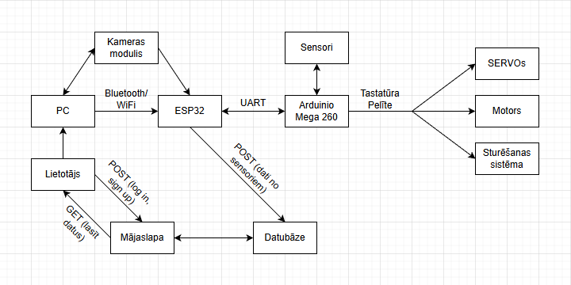
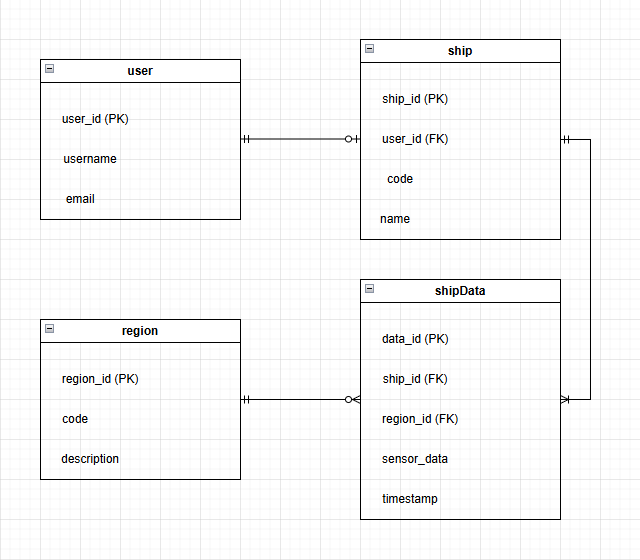

# DataWave

## Idejas apraksts
“DataWave” ir projekts, kas paredzēts ērtai un efektīvai vides datu vākšanai un analīzei. Tas sastāv no divām daļām — kompaktiem kuģiem, kas ir aprīkoti datu vākšanai, un mājaslapas, kurā var apskatīt spiediena, temperatūras un citus parametrus dažādos Zemes apgabalos. Projekts ir paredzēts cilvēkiem ar visdažādāko kompetences līmeni — sākot ar skolēniem un beidzot ar profesionāliem pētniekiem. “DataWave” pilnvērtīgai funkcionēšanai ir nepieciešami četri svarīgi aspekti.
Katrs “DataWave” sistēmas kuģis ir aprīkots ar četriem sensoriem: barometru, temperatūras sensoru, mitruma sensoru un magnetometru. Pirmie trīs parametri ir nepieciešami, lai analizētu klimata pārmaiņas un prognozētu laikapstākļus, tāpēc šie dati ir vitāli svarīgi sabiedrībai. Savukārt magnetometrs ir nepieciešams, lai mērītu Zemes magnētisko lauku dažādos planētas apgabalos. Lai gan magnētiskā lauka indukcija ir nemainīga, tā virziens dažādās vietās atšķiras. Zinot Zemes magnētiskā lauka komponentes, var palīdzēt minerālu meklēšanā un anomāliju noteikšanā.
Iegūtie dati tiek pārraidīti uz sistēmas serveri un ievietoti datubāzē. Ienākot mājaslapā, lietotājs var apskatīt visus parametrus konkrētajā Zemes apgabalā, kā arī redzēt, kā šie dati mainās laika gaitā.
Kuģu vadīšanu kontrolē lietotājs. Vadība tiek īstenota, izmantojot tastatūru, līdz ar to nav nepieciešams atstāt mājas vai laboratoriju. Pogas tiek izmantotas motora jaudas regulēšanai un kustības virziena (uz priekšu vai atpakaļ) kontrolei, izmantojot SERVO motorus un H-bridge, kas maina līdzstrāvas virzienu. Kuģa pagriešanai tiek izmantots viens SERVO motors, kas nosaka ķīļa orientāciju un virzienu. Visbeidzot, uz kuģa ir novietota kamera, kuru lietotājs kontrolē ar peli, iegūstot attēlu, lai apskatītu kuģa apkārtni.

---
 

## Problēmas analīze
Šī projekta mērķauditorija ir ļoti plaša. “DataWave” kuģus var izmantot gan pētnieki-iesācēji, kas vēlas vākt datus ezeros, jūrās vai okeānos un izmantot iegūtos datus laboratorijas darbiem, gan pētniecības centri, kas šos datus izmanto reālu problēmu risināšanai, piemēram, magnētisko polu maiņas un magnētisko anomāliju izpētē vai klimata pārmaiņu analīzē. Visbeidzot, šo projektu var izmantot arī jebkurš interesents — projekta mājaslapā ir pieejami dati katrā Zemes reģionā un grafiki, kas parāda, kā šīs vērtības mainās laika gaitā.
Šo ideju ir vērts attīstīt, jo pašreizējie datu vākšanas veidi bieži vien nav piemēroti konkrētiem uzdevumiem. Lai gan pastāv speciālas iestādes un pētniecības centri, kas nodarbojas ar datu vākšanu un analīzi, tie prasa lielas izmaksas un var vākt datus tikai noteiktos reģionos. Savukārt citas mobilās metodes, ko varētu izmantot zemāka līmeņa pētnieki, ir dārgas vai nepiemērotas. Piemēram, stiprs vējš ūdenskrātuves reģionā var traucēt drona darbību un pat to sabojāt. Kuģis šajā gadījumā ir daudz stabilāks uz ūdens un var izturēt riskus, ko rada ūdenskrātuves vide. Datu pārraidi var būtiski uzlabot, izmantojot antenas, nodrošinot, ka dati tiek savākti pat lielos attālumos no pētniekiem.

---
 

## Projekta shēma

---
 

## ER modelis

---
 

## Izmantotās tehnoloģijas

| Tehnoloģija | Kategorija | Skaidrojums |
| ----------- | ---------- | ----------- |
| HTML | Frontend | Programmas vizuālā daļa, dod iespēju apskatīt datus, autorizēties utt. |
| CSS | Frontend | Mājaslapas dizains |
| FastAPI | Backend | POST/GET vaicājumi uz datubāzi, sensoru datu piekļūve un analīze |
| SQLite | Backend | Uzglaba datus no dažādiem kuģiem
| ESP32 | Mikrokontrolieris | Bluetooth/WiFi savienojums ar PC, padod lietotāja signālus uz otro mikrokontrolieri, sūta datus uz datubāzi (JSON) |
| Arduino Mega 260 | Mikrokontrolieris | Kontrolē tehniku, balstoties uz ESP32 signāliem, atsūta sensoru datus atpakaļ uz ESP32
| SPI | Datu parraides protokols | Sensoru un motoru komunikācija ar mikrokontrolieri, viens mikrokontrolieris -> daudzas ierīces
| I2C | Datu parraides protokols | Sensoru un motoru komunikācija ar mikrokontrolieri, daudzi mikrokontrolieri -> daudzas ierīces |
| UART | Datu parraides protokols | Komunikācija starp ESP32 un Arduino Mega 260

--- 
 

## Plans 10 darba nedeļām

| Nedeļa | Uzdevums |
| ------ | -------- |
| 03.02.26 - 09.02.2026 | Arduino savienošana ar sensoriem |
| 10.02.2026 - 16.02.2026 | Arduino savienošana ar SERVO motoriem, savienošana ar motoru, izmantojot H-bridge |
| 17.02.2026 - 23.02.2026 | GPS moduļa darbība |
| 24.02.2026 - 02.03.2026 | UART savienojums starp Arduino un ESP32 |
| 03.03.2026 - 09.03.2026 | Datu pārveršana par JSON, POST vaicājums uz datubāzi |
| 10.03.2026 - 16.03.2026 | Mājaslapas izveide, dizaina noformēšana |
| 17.03.2026 - 23.03.2026 | FastAPI vaicājumi, datubāzes izveide |
| 24.03.2026 - 30.03.2026 | ESP32 komunikācija ar datubāzi |
| 31.03.2026 - 06.04.2026 | Kameras moduļa darbība |
| 07.04.2026 - 13.04.2026 | Aparatūras izveitošana uz kuģa |

---
 

## Piegādes formāts
Mājaslapa - datu nolasīšana  
GUI aplikācija - kameras attēls, kuģa sturēšana

---
